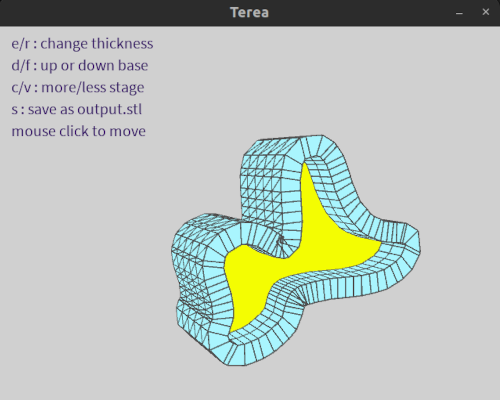

# TEREA
a basic Processing shape extruder

## TEREA works like that

  - download and install [toxiclibs](https://github.com/postspectacular/toxiclibs/releases/tag/0021)
  - upload a svg file
  - select high of outline base and thickness
  - save as .stl
 
## How use it ?

 - Put svg file call 'input.svg' in data 
 - press key as desire, all used key are written in up-left corner

## Prepare svg file in Inskcape
 - prepare your shape, curved lines looks better than straight
 - add more points between to increase resolution
 - save as svg simple
